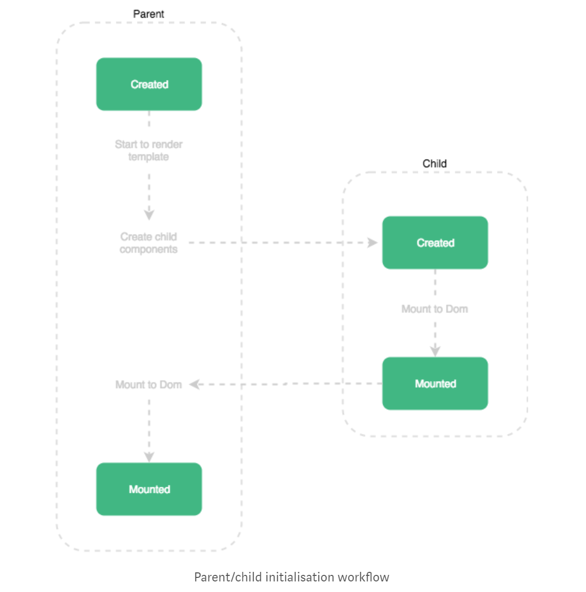
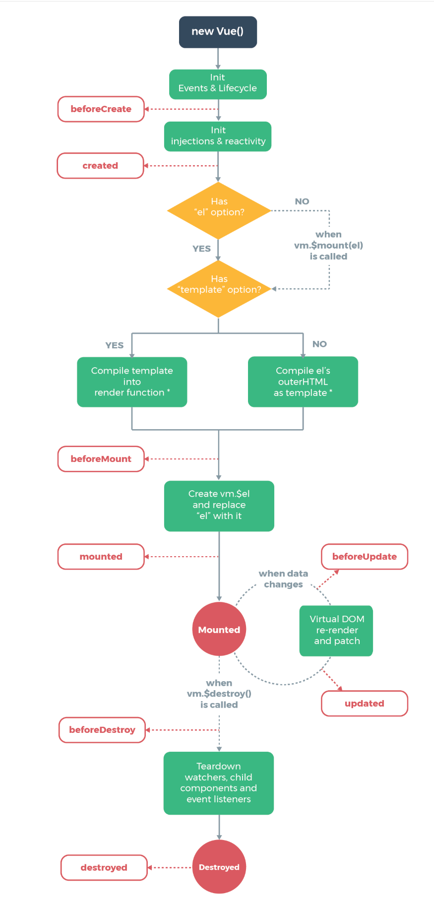
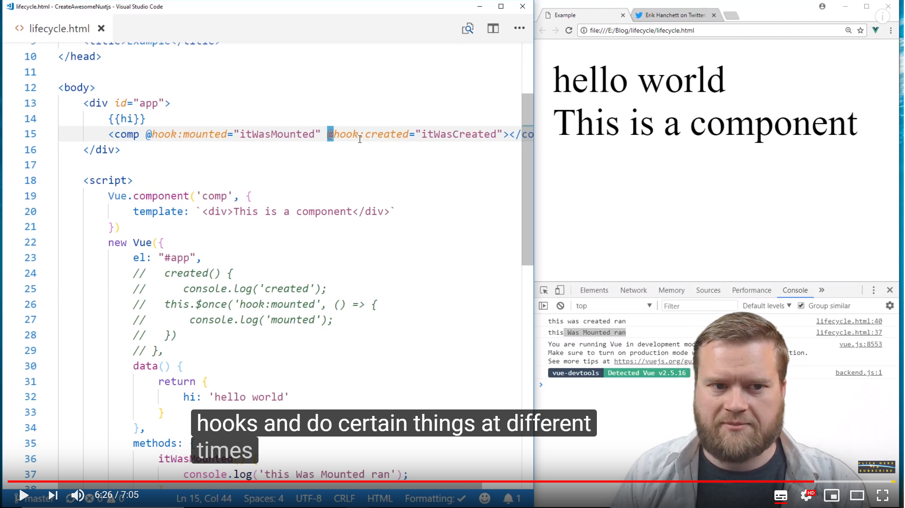

# Vue.Js Study
* Vue.JS를 스터디하는 레파지토리 입니다.
* 기간 : 19년 1월 22

<br>

# 1. binding
* 단방향 data binding
* 양방향 data binding

<br>

# 2. directive : 라이브러리에서 DOM엘리먼트가 무언가를 수행하도록 지시하는 특수한 토큰
## (1) v-if / v-show
* 조건에 따라 엘리먼트를 화면에 표시
## (1-1) v-else
* v-if의 평가 결과가 거짓이면 엘리먼트를 표시
## (2) v-for 
```vue
<li v-for="(value, key, index) in story" class="list-group-item">
  {{index}} : {{key}} : {{value}}
</li>
 ```
## (3) v-on (이벤트 리스너를 엘리먼트에 붙힘)
* 4가지 이벤트 한정자
  1) .prevent
  2) .stop
  3) .capture
  4) .self
 ```vue
 <!-- prevent를 이용한 제출버튼 -->
 <button type="submit" @click="calculate">Calculate</button>
 ```
 ```vue
  <!-- submit 이벤트는 더는 페이지를 새로고침하지 않습니다. -->
 <button type="submit" @click.prevent="calculate">Calculate</button>
 ```
* :click or @
* 키 한정자 :keyup.enter = :keyup.13
```vue
enter, tab, delete, esc, space, up, down, left, right
-------------------
<!-- 전체 문법 -->
<a v-on:click="doSomething"> ... </a>

<!-- 약어 -->
<a @click="doSomething"> ... </a>
```
* :keypress
* :keydown
## (4) v-bind or :
* 하나 이상의 **속성 또는 컴포넌트 프로퍼티**를 표현식에 **동적으로 바인딩**하는데 사용(동적으로 바꾸기)

```vue
<!-- 전체 문법 -->
<a v-bind:href="url"> ... </a>

<!-- 약어 -->
<a :href="url"> ... </a>
```

## (5) v-model
* **v-model.number** (사용자가 입력하는 것을 숫자로 저장)
```vue
<body>
  <div class="container">
    a={{ a }}, b={{ b }}
    <input v-model.numbr="a">
    <pre> {{data}} </pre>
  </div>
</body>
```
# 3. methods
```vue
<script>
export default {
//  메서드 객체 아래 메서드 정의
  methods: {
    clickEvent: function() {
    //  메서드 내 this는 Vue 인스턴스를 가리킴
    this.data++;
    }
  }
};
</script>
```
# 4. computed
* 계산된 프로퍼티
* 뷰의 인라인 표현은 편하지만 로직이 복잡해지면 computed를 사용해야함
* computed properties란 다른 요인에 따라 값이 바뀌는 변수. 객체 프로퍼티로 사용할 수 있는 함수처럼 동작.
```vue
<script>
export default {
   computed: {
    showList() {
    //  this는 Vue의 인스턴스
      return this.models;
    }
  }
};
```
* 예를 들면, **연산량이 많거나 data를 유지해야할 때** 사용하면 좋음
* 계산된 캐싱(Computed Caching) vs 메소드(Methods)
```
계산된 속성 대신 methods로 정의 가능, 두가지의 접근 방식은 서로 동일함 
이때 차이점은 계산된 속성은 종속성에 따라 캐시된다

무슨말인지 알아보면 
계산된 속성(computed)은 종속성 중 일부가 변경된 경우에만 다시 계산 
위의 예에서 message 가 변경되지 않는 한,  reversedMessage에 대한 다중 접근은
함수를 다시 수행할 필요 없이 이전에 계산된 결과를 즉시 반환함 

만약 computed 안에 실시간으로 날짜를 나타내는 함수 Date.now() 를 넣는다면 업데이트 되지 않음! 
하지만 methods 호출은 렌더링 할 때마다 항상 호출
```

```
캐싱이 필요한 이유는?
캐싱하지 않으면 시간이 많이 소요되는 A 속성이 필요한 것보다 getter를 더 실행하게 되어 불필요한 작업 실행
따라서 캐싱이 필요하지 않을때는 methods를 사용
출처: https://takeuu.tistory.com/25 [워너비스페셜]
```


# 5.filter

* 배열의 항목 필터링
```vue
<script>
export default {
  methods: {
  //  작가에 따라 이야기를 필터링하는 메서드
    storiesBy: function (writer) {
      return this.stories.filter(function (story) {
        return story.writer === writer
      }
  }
};
</script>
```
* 배열의 항목 정렬
```vue
<script>
export default {
   computed: {
    orderedStories: function () {
    //  JS 내장함수 sort사용
    //  배열의 요소를 정렬
      return this.stories.sort(function(a, b){
      //  배열을 반환
        return a.upvotes - b.upvotes;
      })
    }
  }
};
</script>
```

  1) compareFunction(a, b) = 0보다 작으면, a를 b보다 낮은 인덱스로 정렬
  2) compareFunction(a, b) = 0이면, a와 b의 위치를 변경하지 않습니다.
  3) compareFunction(a, b) = 0보다 크면, b를 a보다 낮은 인덱스로 정렬
    
* 사용자 정의 필터 적용
* 유틸리티 라이브러리 활용 : CDN을 통해 html 파일에 추가
  1) [Lodash](https://lodash.com/)
  2) [Underscore](http://underscorejs.org/)
  3) [sugar](https://sugarjs.com/)
```javascript
//  문법
//  첫번째prop : 정렬할 배열
//  두번째prop : 정렬 기준이 될 키의 배열
//  세번째prop : 각 키의 순서로 구성된 배열
_.orderBy(collection, [iteratees=[_.identity]], [orders])
```
<br>

# 6. LifeCycle : 라이프 사이클에서는 => 함수 사용 X

### (1) Creation : 컴포넌트 초기화 (이벤트와 생명주기 메소드가 쵝화, 메소드 및 데이터 옵션을 주입(바인딩)하고 반응형으로 설정)
* **before create** : data, events 세팅 전
* **created** : data, events 활성화( template, 가상돔 -> mount, rendering X )

### (2) Mounting : 돔(DOM) 삽입단계 (템플릿을 읽어와 문법을 적용하고 화면에 렌더링)
* **before Mount** : template, 렌더함수가 **렌더링**된 후 첫 렌더링 직전에 실행 ( 비권장, server-side-rendering시 호출 X )
* **Mounted** : component, template, 렌더링된 DOM 접근 가능 (모든 하위 component가 마운팅 상태 보장은 X, s-s-r 호출 X )

<p align="center">
	
</p>

### (3) Updating : Diff. 재렌더링 단계 (데이터 속성의 변화를 감지하면 화면을 다시 렌더링)
* **before Update** : 돔 재렌더링 -> Before0Update -> 패치 ( 재렌더링 전의 새 상태의 data 얻을 수 O )
* **updated** : 돔이 업데이트된 상태, 돔 종속 연산 가능

### (4) Destruction : 해제 단계 (데이터의 반응 해제 및 이벤트를 삭제하고 인스턴스를 )
* **before Destroy** : 뷰인스턴스 제거 **직전**에 호출됨
* **destroyed** :  뷰인스턴스 제거 **후** 호출 됨

<p align="center">
	
</p>

### life-cycle Hooks Tutorial
* https://www.youtube.com/watch?v=8rn3SK4N8Go
* https://www.youtube.com/watch?v=ZxAtIf5GkYM
* https://www.youtube.com/watch?v=XWMiHKD-hrg

<p align="center">
	
</p>


# 7. 사용자 정의 이벤트

### $on(event)를 이용해 이벤트 **청취**

### $emit(event)를 이용해 이벤트 발생
*  자식component에서 부모 component로 변경사항 **전달**

```vue
<script type="text/javascript">
  Vue.component('chariot', {
      template: '#chariot-template',
      //  부모와 자식 컴포넌트 통신
      props:['chariot],
      methods: {
          rideChariot: function (chariot) {
              //  이벤트 이름 인자와 함께 리스너 콜백함수에 추가로 전달합니다(arrow함수)
              this.$emit('select', chariot)
          }
      },
      :
 </script>
```

* **$emit에서 설정한 'select'** 가 아래의 부모자식 태그 안에 **@select**로 들어감. 그 때, @select="내부함수"실행 시킴

```vue
<body>
  <div class="container">
      <h1>Chariot shopping</h1>
      <ul class="list-group">
          <chariot v-for="(chariot, index) in chariots" :key="index" :chariot="chariot" @select="updateChariot"></chariot>
      </ul>
      <pre>{{ $data }}</pre>
  </div>
```

### $once(event)를 이용해 이벤트를 한 번만 청취

### $off()를 이용해 이벤트 리스너를 제거

### eventbus
* 형제 component 통신에서 **가상의 부모 component 역할**
