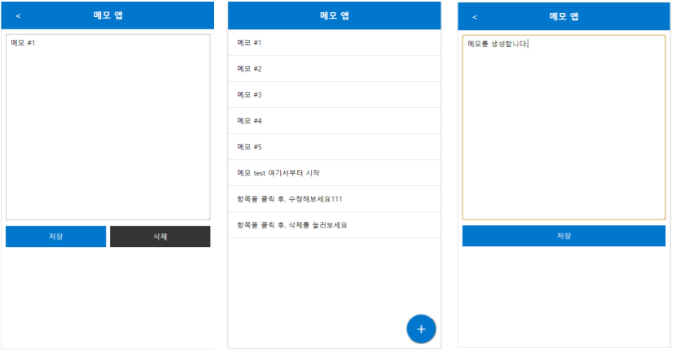

# Vue.Js Study
* Vue.JS를 스터디하는 레파지토리 입니다.
* 1월

 

# 1. binding
* 단방향 data binding
* 양방향 data binding

 

# 2. directive
## (1) v-if / v-show
## (2) v-for
## (3) v-on
* keyup.enter
* keypress
* keydown
## (4) v-bind
* 동적으로 바꾸기

 

# 3. memoApp
## (1) data 추가
* localStorage기능으로 저장
* content null 처리 (textarea에 이전에 입력한 값 남아있지 않도록)
* data를 localStorage에서 불러옴 (json파일을 parsing해서 get)

## (2) data 수정 & 삭제
* 각 항목 클릭시 secondDepth인 상세보기 출력
* mode가 edit시에만 '삭제'버튼 생성
* mode가 list가 아닐 때만 뒤로가기 '<'버튼 생성
