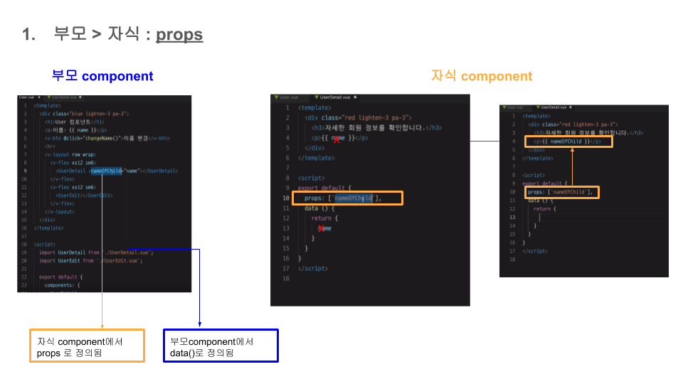
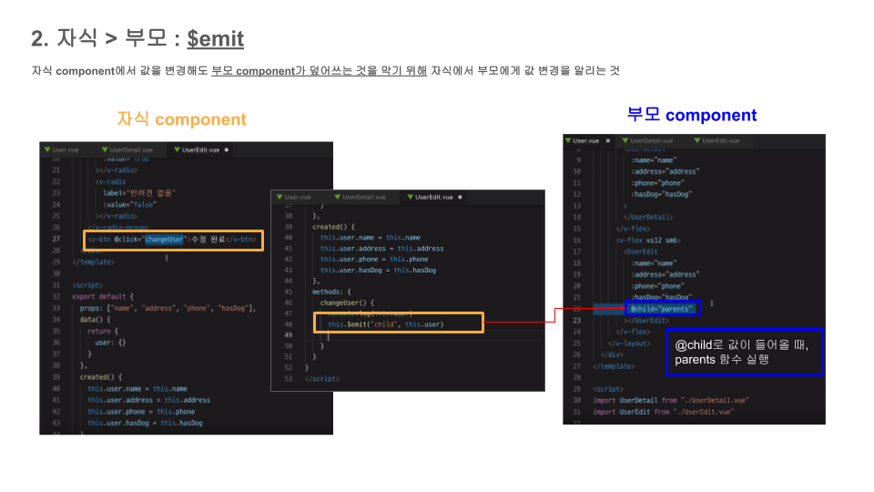
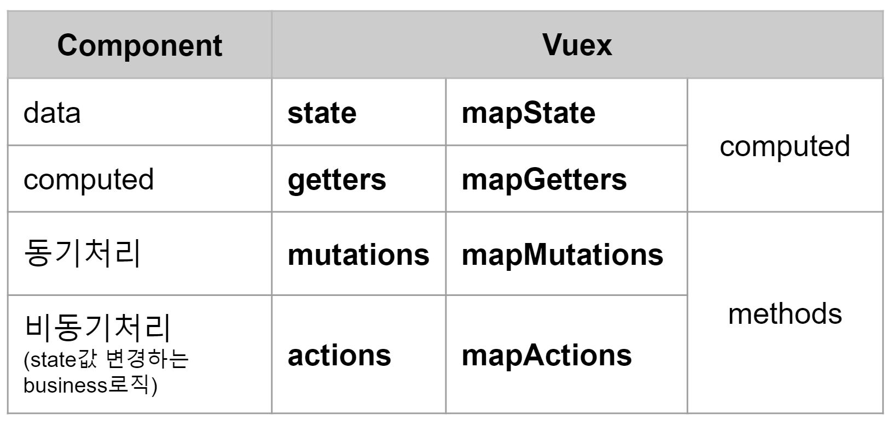
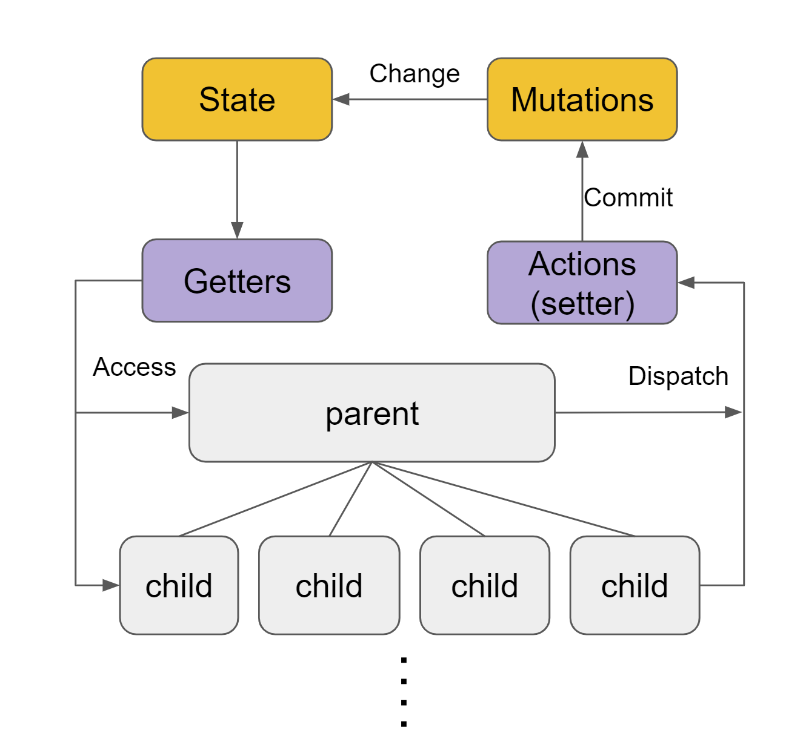
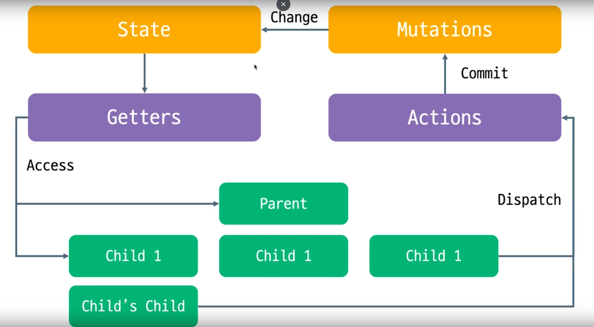

# Vue.Js Study
* Vue.JS를 스터디하는 레파지토리 입니다.
* 기간 : 19년 1월 22

<br>

# 1. binding
* 단방향 data binding
* 양방향 data binding

<br>

# 2. directive

* 라이브러리에서 DOM엘리먼트가 무언가를 수행하도록 지시하는 특수한 토큰

## (1) v-if / v-show
* 조건에 따라 엘리먼트를 화면에 표시
## (1-1) v-else
* v-if의 평가 결과가 거짓이면 엘리먼트를 표시
## (2) v-for 
```vue
<li v-for="(value, key, index) in story" class="list-group-item">
  {{index}} : {{key}} : {{value}}
</li>
 ```
## (3) v-on (이벤트 리스너를 엘리먼트에 붙힘)
* 4가지 이벤트 한정자
  1) .prevent
  2) .stop
  3) .capture
  4) .self
 ```vue
 <!-- prevent를 이용한 제출버튼 -->
 <button type="submit" @click="calculate">Calculate</button>
 ```
 ```vue
  <!-- submit 이벤트는 더는 페이지를 새로고침하지 않습니다. -->
 <button type="submit" @click.prevent="calculate">Calculate</button>
 ```
* :click or @
* 키 한정자 :keyup.enter = :keyup.13
```vue
enter, tab, delete, esc, space, up, down, left, right
-------------------
<!-- 전체 문법 -->
<a v-on:click="doSomething"> ... </a>

<!-- 약어 -->
<a @click="doSomething"> ... </a>
```
* :keypress
* :keydown
## (4) v-bind or :
* 하나 이상의 **속성 또는 컴포넌트 프로퍼티**를 표현식에 **동적으로 바인딩**하는데 사용(동적으로 바꾸기)

```vue
<!-- 전체 문법 -->
<a v-bind:href="url"> ... </a>

<!-- 약어 -->
<a :href="url"> ... </a>
```

## (5) v-model
* **v-model.number** (사용자가 입력하는 것을 숫자로 저장)
```vue
<body>
  <div class="container">
    a={{ a }}, b={{ b }}
    <input v-model.numbr="a">
    <pre> {{data}} </pre>
  </div>
</body>
```
# 3. methods
```vue
<script>
export default {
//  메서드 객체 아래 메서드 정의
  methods: {
    clickEvent: function() {
    //  메서드 내 this는 Vue 인스턴스를 가리킴
    this.data++;
    }
  }
};
</script>
```
# 4. computed
* 계산된 프로퍼티
* 뷰의 인라인 표현은 편하지만 로직이 복잡해지면 computed를 사용해야함
* computed properties란 다른 요인에 따라 값이 바뀌는 변수. 객체 프로퍼티로 사용할 수 있는 함수처럼 동작.
```vue
<script>
export default {
   computed: {
    showList() {
    //  this는 Vue의 인스턴스
      return this.models;
    }
  }
};
```
* 예를 들면, **연산량이 많거나 data를 유지해야할 때** 사용하면 좋음
* 계산된 캐싱(Computed Caching) vs 메소드(Methods)
```
계산된 속성 대신 methods로 정의 가능, 두가지의 접근 방식은 서로 동일함 
이때 차이점은 계산된 속성은 종속성에 따라 캐시된다

무슨말인지 알아보면 
계산된 속성(computed)은 종속성 중 일부가 변경된 경우에만 다시 계산 
위의 예에서 message 가 변경되지 않는 한,  reversedMessage에 대한 다중 접근은
함수를 다시 수행할 필요 없이 이전에 계산된 결과를 즉시 반환함 

만약 computed 안에 실시간으로 날짜를 나타내는 함수 Date.now() 를 넣는다면 업데이트 되지 않음! 
하지만 methods 호출은 렌더링 할 때마다 항상 호출
```

```
캐싱이 필요한 이유는?
캐싱하지 않으면 시간이 많이 소요되는 A 속성이 필요한 것보다 getter를 더 실행하게 되어 불필요한 작업 실행
따라서 캐싱이 필요하지 않을때는 methods를 사용
출처: https://takeuu.tistory.com/25 [워너비스페셜]
```


# 5.filter

* 배열의 항목 필터링
```vue
<script>
export default {
  methods: {
  //  작가에 따라 이야기를 필터링하는 메서드
    storiesBy: function (writer) {
      return this.stories.filter(function (story) {
        return story.writer === writer
      }
  }
};
</script>
```
* 배열의 항목 정렬
```vue
<script>
export default {
   computed: {
    orderedStories: function () {
    //  JS 내장함수 sort사용
    //  배열의 요소를 정렬
      return this.stories.sort(function(a, b){
      //  배열을 반환
        return a.upvotes - b.upvotes;
      })
    }
  }
};
</script>
```

  1) compareFunction(a, b) = 0보다 작으면, a를 b보다 낮은 인덱스로 정렬
  2) compareFunction(a, b) = 0이면, a와 b의 위치를 변경하지 않습니다.
  3) compareFunction(a, b) = 0보다 크면, b를 a보다 낮은 인덱스로 정렬
    
* 사용자 정의 필터 적용
* 유틸리티 라이브러리 활용 : CDN을 통해 html 파일에 추가
  1) [Lodash](https://lodash.com/)
  2) [Underscore](http://underscorejs.org/)
  3) [sugar](https://sugarjs.com/)
```javascript
//  문법
//  첫번째prop : 정렬할 배열
//  두번째prop : 정렬 기준이 될 키의 배열
//  세번째prop : 각 키의 순서로 구성된 배열
_.orderBy(collection, [iteratees=[_.identity]], [orders])
```
<br>

# 6. LifeCycle

### (1) Creation : 컴포넌트 초기화 (이벤트, 생명주기 메소드 초기화, 메소드 및 데이터 옵션을 버안당하고 반응형으로 설정)
* **before create** : data, events 세팅 전
* **created** : data, events 활성화( template, 가상돔 -> mount, rendering X )

### (2) Mounting : 돔(DOM) 삽입단계 (템플릿을 읽어와 문법 적용, 화면 렌더링)
* **before Mount** : template, 렌더함수가 **렌더링**된 후 첫 렌더링 직전에 실행 ( 비권장, server-side-rendering시 호출 X )
* **Mounted** : component, template, 렌더링된 DOM 접근 가능 (모든 하위 component가 마운팅 상태 보장은 X, s-s-r 호출 X )

<p align="center">
	
</p>

### (3) Updating : Diff. 재렌더링 단계 (데이터 속성의 변화를 감지하면 화면을 다시 렌더링)
* **before Update** : 돔 재렌더링 -> Before0Update -> 패치 ( 재렌더링 전의 새 상태의 data 얻을 수 O )
* **updated** : 돔이 업데이트된 상태, 돔 종속 연산 가능
* The lifecycle hooks around update respond to **changes in the DOM**. Watchers respond to **changes in the data**. DOM changes are generally in response to data changes, but they might not be data owned by the component in question. [ex](https://stackoverflow.com/a/44985995/11657743)

### (4) Destruction : 해제 단계 (데이터의 반응 해제 및 이벤트를 삭제)
* **before Destroy** : 뷰인스턴스 제거 **직전**에 호출됨
* **destroyed** :  뷰인스턴스 제거 **후** 호출 됨

<p align="center">
	
</p>

### life-cycle Hooks Tutorial
* https://www.youtube.com/watch?v=8rn3SK4N8Go
* https://www.youtube.com/watch?v=ZxAtIf5GkYM
* https://www.youtube.com/watch?v=XWMiHKD-hrg

<p align="center">
	
</p>


# 7. 사용자 정의 이벤트

### 1) $on(event)를 이용해 이벤트 **청취**

### 2) $emit(event)를 이용해 이벤트 발생

* 부모 > 자식 : **props**

<p align="center">
	
</p>

*  자식 > 부모 변경사항 전달 : **emit**

<p align="center">
	
</p>

```vue
<script>
  Vue.component('chariot', {
      template: '#chariot-template',
      //  부모 > 자식 컴포넌트 통신
      props:['chariot'],
      methods: {
          rideChariot: function (chariot) {
              //  이벤트 이름 인자와 함께 리스너 콜백함수에 추가로 전달합니다(arrow함수)
              this.$emit('select', chariot)
          }
      }
      :
```

* **$emit에서 설정한 'select'** 가 아래의 부모자식 태그 안에 **@select**로 들어감. 그 때, @select="내부함수"실행 시킴

```vue
<body>
  <div class="container">
      <h1>Chariot shopping</h1>
      <ul class="list-group">
          <chariot v-for="(chariot, index) in chariots" :key="index" :chariot="chariot" @select="updateChariot"></chariot>
      </ul>
      <pre>{{ $data }}</pre>
  </div>
```

### 3) $once(event)를 이용해 이벤트를 한 번만 청취

### 4) $off()를 이용해 이벤트 리스너를 제거

### 5) eventbus
* 형제 component 통신에서 **가상의 부모 component 역할**
* eventbus : https://www.youtube.com/watch?v=tlcofmjZJEA&index=8&list=PLZzSdj89sCN0sLqrTKf2m7lXe_93C19UG
* props : https://www.youtube.com/watch?v=L8VLByQLtjc&list=PLZzSdj89sCN0sLqrTKf2m7lXe_93C19UG&index=5
* props의 활용 : https://www.youtube.com/watch?v=7T8F7ZF52lo&list=PLZzSdj89sCN0sLqrTKf2m7lXe_93C19UG&index=6

# 8. Vuex

* 여러 컴포넌트 간 통신간에는 **중앙관리체계**가 필요함
* props, emit, eventbus 대체
* **vuex란 ?** https://vuex.vuejs.org/kr/
* vuex에 함수, 상태 저장 -> 다른 컴포넌트에서 자유롭게 접근 가능
* vuex와 컴포넌트 비교

<p align="center">
	
</p>

<p align="center">
	
</p>


### 1) vue create

* **state** : Vue 인스턴스의 data라고 생각하면 됨
* **getters** : computed
* **mutations** : 변이 (state값을 변화시킴) (모든 기능이 **동기**로 동작함)
* **actions** : **비동기** 로직 처리(mutation을 변화시키는 business 로직)
-------------------------------------------------------------------------------
* **store.js** : 저장소

```javascript
import Vue from 'vue'
import Vuex from 'vuex'

Vue.use(Vuex)

export default new Vuex.Store({
  state: {  //  data
    allUsers:[
      {userId:'123', password: '1234', name: 'tonz', address: 'Seoul'}
        :
    ]
  },
  mutations: {
  },
  actions: {
  }
})
```

* 중앙통제관리소 격인 **main.js** 파일에 Vuex설정해야함(각 컴포넌트에서 import X)

```javascript
:

import store from './store'
:
new Vue({
  router,
  store,
  render: h => h(App)
}).$mount('#app')
```

* **AllUsers.vue** 와 같은 컴포넌트에서의 접근 : **$store.state.allUsers**
```vue
<template>
  <div>
    <h1>All Users ({{ $store.state.allUsers.length }})</h1>
    :
  <v-list-tile
    v-for="(user, index) in $store.state.allUsers"
    :key="index"
    avatar>
  :

</template>

<script>
  export default {
    data() {
      return {
      }
    },
    mounted () {
      EventBus.$on('SignUp'. users => {
        this.$store.state.allUsers.push(users)
      })
    }
  }
</script>
```

### 2) Getters
* 복잡한 계산식이 될 때 용이함
* state 자체를 가져오기 위한 getter들
* **store.js**

```javascript
import Vue from 'vue'
import Vuex from 'vuex'

Vue.use(Vuex)

export default new Vuex.Store({
  state: {  //  data
    allUsers:[
      {userId:'123', password: '1234', name: 'tonz', address: 'Seoul'}
        :
    ]
  },
  getters: {  // computed
    allUsersCount: function(state) {  //  state로 반드시 들어가야함
      return state.allUsers.length
    },
    countOfSeoul: state => {
      let count = 0
      state.allUsers.forEach(user => {
        if(user.address === 'Seoul') count ++
      })
      return count
    },
    percentOfSeoul: (state, getters) => { //  state로 반드시 받아야 두번째 인자 인식
      return Math.round(getters.countOfSeoul / getters.allUsersCount * 100)
    }
  },
  mutations: {
  },
  actions: {
  }
})
```

* getters로 **AllUsers.vue** 와 같은 컴포넌트에서의 접근 : **$store.getters.allUsersCount**

```vue
<template>
  <div>
    <h1>Seoul Users : ({{ $store.getters.countOfSeoul }}) ({{ $store.getters.percentOfSeoul }}%)</h1>
  :
  <v-list-tile
    v-for="(user, index) in $store.getters.allUsersCount"
    :key="index"
    avatar>
  :

</template>

<script>
  export default {
    data() {
      return {
      }
    },
    mounted () {
      EventBus.$on('SignUp'. users => {
        this.$store.state.allUsers.push(users)
      })
    }
  }
</script>
```

### 3) Map Getters
* getters에서 쓰고 있는 값들을 사용하고자하는 컴포넌트에 **간단하게** 불러내는 것
* map getters로 **AllUsers.vue** 와 같은 컴포넌트에서의 접근 : **배열**로 받기

```vue
<template>
  <div>
    <h1>Seoul Users : ({{ countOfSeoul }}) ({{ percentOfSeoul }}%)</h1>
  :
</template>

<script>
import { mapGetters } from 'vuex' // vuex에서 미리 설정되어 있으므로 vuex에서 임포트
  export default {
    data() {
      return {
      }
    },
    computed: {
      //  배열로 받음
      ...mapGetters(['allUsersCount', 'countOfSeoul', 'percentOfSeoul']) // mapGetters에서 불러와야 간단히 사용가능
    },
    mounted () {
      EventBus.$on('SignUp'. users => {
        this.$store.state.allUsers.push(users)
      })
    }
  }
</script>
```

* **AllUsers.vue** 다른 값으로 받아서 쓸 때 mapGetters를 **객체**로 받기
* **mapState**
```vue
<template>
  <div>
    <h1>All Users : ({{ count }})</h1>
    <h1>Seoul Users : ({{ seouls }}) ({{ percent }}%)</h1>
  :
  <v-list-tile
    v-for="(user, index) in allUsers" //  mapState에서 
    :key="index"
    avatar>
  :
</template>

<script>
import { mapState, mapGetters } from 'vuex'
  export default {

    computed: {
      ...mapGetters({ //  객체로 받음
        count: 'allUsersCount',
        seouls: 'countOfSeoul',
        percent: 'percentOfSeoul'
      }),
      ...mapState(['allUsers'])
    },
:
</script>
```

### 4) mutations

* store.commit() : mutation 호출
* WHY ? 각 컴포넌트에서 동일하게 쓰이면 **코드중복** -> state를 변화시키는 mutation을 각 컴포넌트에서 활용!(**commit**)
* state의 setter 혹은 updater의 역할
* **store.js**

```javascript
:
export default new Vuex.Store({
  state: {  //  data
    allUsers:[
      {userId:'123', password: '1234', name: 'tonz', address: 'Seoul'}
        :
    ]
  },
  mutations: {
    addUsers: (state, payload) => {
      state.allUsers.push(payload)
    }
  },
  actions: {
  }
})
```

* **SignUp.vue** : **mapMutations**
```vue
<template>
  :
</template>

<script>
import { mapMutations } from 'vuex'

  export default {
    :
    computed: {
      ...mapGetters({ //  객체로 받음
        count: 'allUsersCount',
        seouls: 'countOfSeoul',
        percent: 'percentOfSeoul'
      }),
      ...mapState(['allUsers'])
    },
    methods: {
      ...mapMutations(['addUsers']),
      signUp () {
        let userObj = {
          userId : this.userId,
          :
        }
        this.addUsers(userObj) // userObj는 store.js의 payload로 날아감
        //  EventBus.$emit('signUp', userObj)
        :
      }
    }
:
</script>
```

* **SignUp.vue** : mapMutation이 아닌 **commit('mutation이름', 넘길 payload)으로 불러오기**
```vue
<template>
  :
</template>

<script>
//  import { mapMutations } from 'vuex'

  export default {
    :
    computed: {
      //  ...mapGetters({ //  객체로 받음
        count: 'allUsersCount',
        seouls: 'countOfSeoul',
        percent: 'percentOfSeoul'
      }),
      ...mapState(['allUsers'])
    },
    methods: {
      ...mapMutations(['addUsers']),
      signUp () {
        let userObj = {
          userId : this.userId,
          :
        }
        this.$store.commit('addUsers', userObj)
        //  this.addUsers(userObj) // userObj는 store.js의 payload로 날아감
        //  EventBus.$emit('signUp', userObj)
        :
      }
    }
:
</script>
```

### 5) actions

<p align="center">
	
</p>

* store.dispatch() : action 호출
* 각 컴포넌트에서 dispatch받은 후 mutations으로 commit날림
* state를 변화시키기위한 business 로직 포함(ex. 비동기 방식으로 서버와 통신)
* 비동기 작업 후 mutation 실행
* **store.js**

```javascript
:
export default new Vuex.Store({
  state: {  //  data
    allUsers:[
      {userId:'123', password: '1234', name: 'tonz', address: 'Seoul'}
        :
    ]
  },
  mutations: {
    addUsers: (state, payload) => {
      state.allUsers.push(payload)
    }
  },
  actions: {  //  이름 겹쳐도 됨
    addUsers: context => {
      //  mutation을 불러오는 방법
      context.commit('addUsers')

    }
  }
})
```

* commit이 많아지면 위의 방법은 불편

```javascript
:
export default new Vuex.Store({
  state: {  //  data
    allUsers:[
      {userId:'123', password: '1234', name: 'tonz', address: 'Seoul'}
        :
    ]
  },
  mutations: {
    addUsers: (state, payload) => {
      state.allUsers.push(payload)
    }
  },
  actions: {  //  이름 겹쳐도 됨
    addUsers: ({ commit }, payload) => { //  function({commit})과 같은 의미
    //  context, payload
    //  { commit }, payload
    
    //  이곳에 서버와 통신하는 business로직 나열
    :
    :

     commit('addUsers', payload)  //  state를 변화시키는 한 줄!
    }
  }
})
```

* **SignUp.vue** : actions를 불러오기 **dispatch**
```vue
<template>
  :
</template>

<script>
import { mapMutations } from 'vuex'

  export default {
    :
    methods: {
      ...mapMutations(['addUsers']),
      signUp () {
        let userObj = {
          userId : this.userId,
          :
        }
        // this.addUsers(usrObj)
        this.$store.dispatch('addUsers', userObj)
        :
      }
    }
:
</script>
```

* **SignUp.vue** : mapActions 활용
```vue
<template>
  :
</template>

<script>

import { mapActions } from 'vuex'

  export default {
    :
    methods: {
      //...mapMutations(['addUsers']),
      ...mapActions(['addUsers']),
      signUp () {
        let userObj = {
          userId : this.userId,
          :
        }
        // this.addUsers(usrObj)
        //  this.$store.dispatch('addUsers', userObj)
        this.addUsers(userObj)
        :
      }
    }
:
</script>
```
--------------------------------------------
* vuex : https://www.youtube.com/playlist?list=PLZzSdj89sCN292abcbI3utND8pA1T1OyB

# 9. nextTick

### 1) Vue.js에서 nextTick 사용하기

* **nextTick**으로 감싼뒤 callback을 통해 DOM을 조작하게 되면 Vue.js에서 데이터갱신 후 UI까지 완료한 뒤에 nextTick에 있는 함수를 최종적으로 수행하게 됩니다.

```vue
created: function() {

    // ...

    this.$nextTick(function() {
    	var dom = document.getElementById('item-0');
        dom.style.backgroundColor = 'red';
    });
}
```
* 출처 : http://vuejs.kr/jekyll/update/2017/01/19/vuejs-nexttick-example/
* 예제 : https://jsfiddle.net/devjin0617/pgscu4q3/

### 2) Vue.js에서 nextTick 활용하기

```
코드상으로 의도는 select box 에서 pig 를 선택하는 경우
화면에 pig 는 animal 이라고 표현하려고 한다. 혹은 apple 를 선택하면 fruit 로 표기한다.
하지만 놀랍게도(!) 코드는 의도와 반대로 동작한다.
```

* **why?**

```
 click 이벤트는 v-model 값이 변경되기 전에 호출되고
 호출이 끝나고 나서야 v-model 값이 변경되기 때문이다.
 다시말해 select box 에 pig 가 선택되어 있는 상태에서 apple 로 변경하려고 할 때
 아직 pig 인 상태에서 click 이벤트가 다 끝나게 되고
 그 후에 v-model 은 apple 로 변경된다.
```

* click 이벤트 호출시작, 끝남 (pig인 상태에서 클릭이벤트 종료)
* v-model 값 변경 (이벤트 호출 끝난 이후 apple로 값 변경)

```javascript
<b-form-select v-model="selected" :options="options" @change="Changed"/>
{{ type }}
```

```vue
Changed() {
    if ( this.selected == "pig" )
         this.type = "animal";
    if ( this.selectd == "apple" )
         this.type = "fruit";
}
```

* nextTick

```vue
Changed() {
    Vue.nextTick(() => {
        if ( this.selected == "pig" )
             this.type = "animal";
        if ( this.selectd == "apple" )
             this.type = "fruit";
    });
}
```
* 출처 : https://jybaek.tistory.com/729
