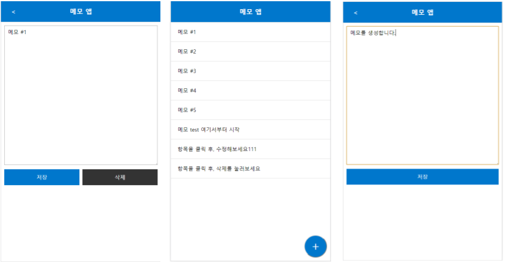

# memoApp

## (1) data 추가
* localStorage기능으로 저장
* content null 처리 (textarea에 이전에 입력한 값 남아있지 않도록)
* data를 localStorage에서 불러옴 (json파일을 parsing해서 get)

## (2) data 수정 & 삭제
* 각 항목 클릭시 secondDepth인 상세보기 출력
* mode가 edit시에만 '삭제'버튼 생성
* mode가 list가 아닐 때만 뒤로가기 '<'버튼 생성
