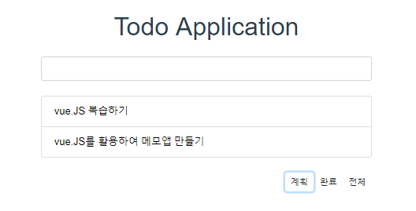
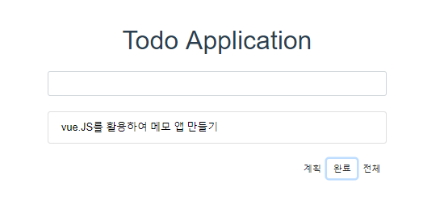
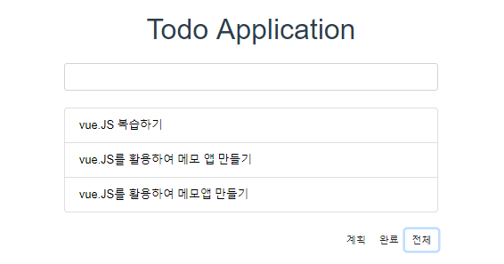

# VueJS Basic

## chapter01 : data binding

* input tag에 JS data binding

  (1) **new Vue**로 instance 만들어 사용

  (2) 외부에서 사용할 때는 **data()** 메서드 사용

* data 출력

  (1) input tag에는 **v-model** attribute로 Vue instance의 data와 연결해서 사용가능

  (2) 화면출력은 {{ **변수** }}

## chapter02 : list

* 반복 태그에 **v-for**라는 attr 사용
* 반복 태그 안에서는 자유롭게 변수사용 가능
* 2개 이상의 **tag가 반복사용**시 > **template**으로 감싼다.

## chapter03 : attr binding

* tag attr 앞에 **v-bind:** or **:** 사용함
* **String / Class**의 경우 **배열**로 관리 가능
* **style**은 JSON key에 **style항목**, value에 **설정 값**
* **Class**는 JSON key에 **적용할 클래스 명**, value에 **t/f로 클래스 사용 여부** 정의

## chapter04 : 메소드 선언 및 event handling

* 메소드 정의 : 내부에서 사용할 함수는 methods **JSON 객체에 만들어 선언**
* 이벤트 처리 : 기존 사용 event를 받아올 때는 @click="**메소드**"

## chapter05 : component

* 다양한 태그를 모아 1개의 custom tag를 만드는 기능

## chapter06 : Todo List App

  
  
  

* vue-cli 사용 기본방법
* directive 복습
* **computed** : 클래스의 getter와 같은 동작
* component 분리방법 : vue 파일 생성 / import(lowercase 필수)

  자세한 내용은 [todo.vue](./chapter06-Todo List App/todo/src/components/todo.vue)에 있습니다.
  
* component에서 **$emit** 사용하여 event 발생
