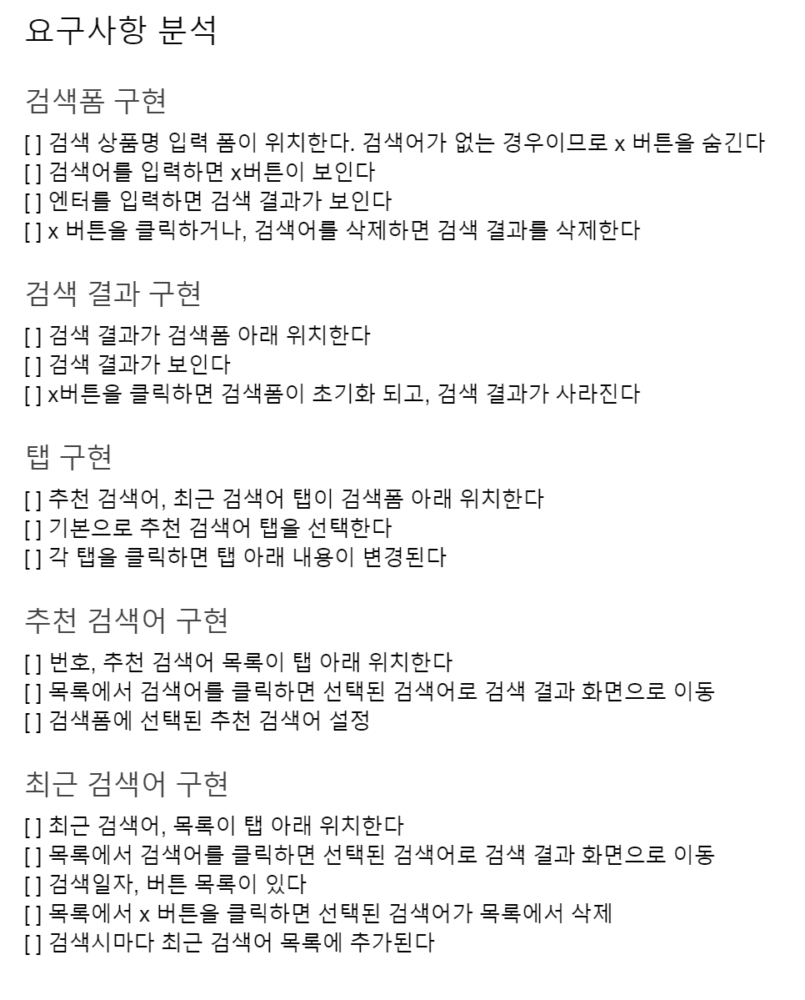

# 실습 UI 개발로 배워보는 순수 Javascript와 VueJS 개발
* https://www.inflearn.com/course/%EC%88%9C%EC%88%98js-vuejs-%EA%B0%9C%EB%B0%9C-%EA%B0%95%EC%A2%8C/

## 이 프로젝트의 tech stack
```vue
lights-server, JavaScript, VueJS, MVC -> MVVM pattern
```

## 1. 요구사항 분석
<p align="center">
	
</p>

### 1) export default란?
* 하나의 .vue 파일이 하나의 독립적인 컴포넌트를 정의 한다
* https://kr.vuejs.org/v2/guide/single-file-components.html

### 2) [Model](./mine/1-vanilla/js/models)
* HistroryModel.js
* KeywordModel.js
* SearchModel.js
### 3) [View](./mine/1-vanilla/js/views)
* FormView.js
* ResultView.js
* View.js
### 4) [Controller](./mine/1-vanilla/js/controllers)
* MainControllers.js

## 2. 단일 컴포넌트(.vue)
* 가독성과 유지보수의 편리함
### 1) 설치방법
#### (1) cmd
**npm install -g vue-cli**

**vue**
* init
* list
* build
* help

**vue list**

**vue init webpack-simple**

**npm install**
* 개발서버를 띄우려면 설치해야함

**npm run dev**
* 브라우저에 창 뜬 것 확인

### 2) 싱글 파일 컴포넌트
#### (1) 기본 설정
* main.js : 어플리케이션 진입점
* App.vue : 메인 어플리케이션 (template/script/style)
* index.html : style link 연결, viewport 설정

```html
<head>
  <meta http-equiv="X-UA-Compatible" content="IE=edge,chrome=1" />
  :
```
