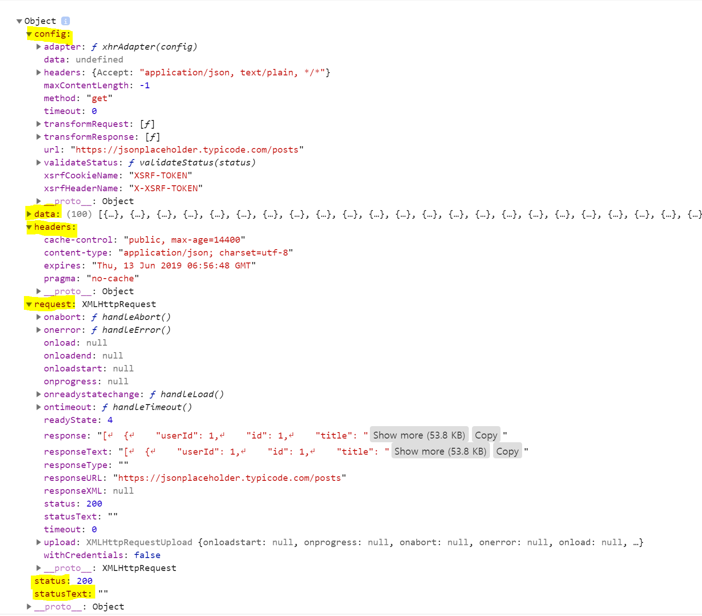

# axios-project

### 1) vue-cli 설치
### 2) axios

* axios 설치

```
$ npm install --save axios
```

* main.js

```javascript
import Vue from 'vue'
import App from './App.vue'
//  axios import
import axios from 'axios'

Vue.config.productionTip = false
//  global로 사용가능
Vue.prototype.$http = axios

new Vue({
  render: h => h(App),
}).$mount('#app')

```

* App.vue

```vue
<script>
:
methods: {
    searchTerm: function () {
      const baseURI = 'https://jsonplaceholder.typicode.com'
      this.$http.get(`${baseURI}/posts`)
      .then((response) => {
        console.log(response)
        this.posts = response.data
      })
    }
  }
:
</script>
```
* response 
<p align="center">

</p>

### 3) axios & IE : https://github.com/stefanpenner/es6-promise

* es6-promise

```
$ npm install --save es6-promise
```

* webpack의 설정 파일 (babel.config.js)

```javascript
require('es6-promise').polyfill();
// 또는
require('es6-promise/auto');
```

------------------------------
* axios : https://github.com/axios/axios
* axios upgrade guide : https://github.com/axios/axios/blob/master/UPGRADE_GUIDE.md
* example : https://wpsn-axios-example.glitch.me/
